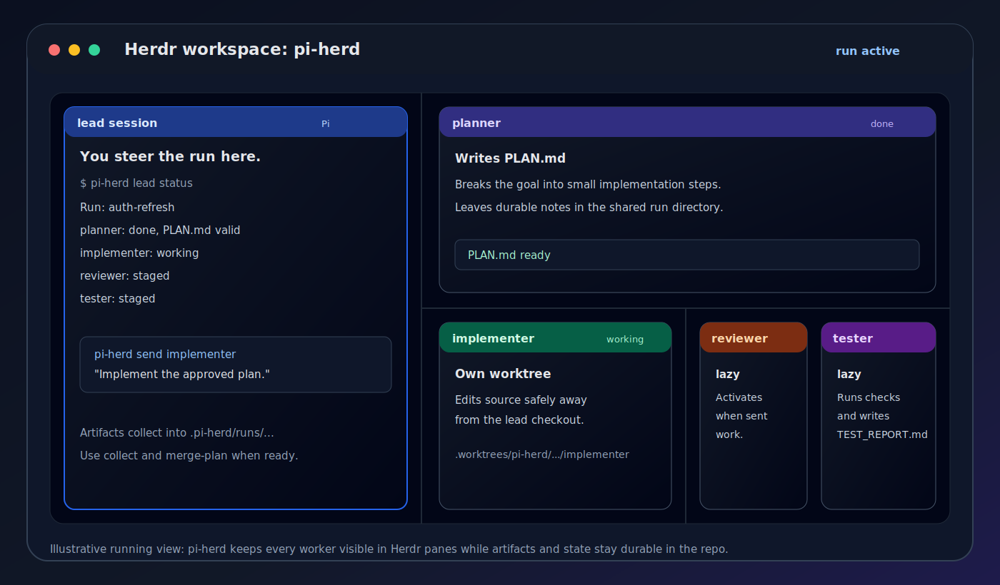

# pi-herd

[](https://github.com/ribbons-digital/pi-herd/actions/workflows/ci.yml)

Visible Pi session orchestration with Herdr panes and git worktrees.

pi-herd helps you coordinate multiple coding-agent sessions without hiding them inside one parent process.
It creates visible lead and worker sessions in Herdr, keeps workers in isolated git worktrees, and stores run state and artifacts in your repository.

pi-herd is Pi-first today.
The orchestration model is intentionally harness-neutral so other coding-agent runtimes can be added later.



The running view keeps the lead, planner, implementer, reviewer, and tester visible as normal Herdr panes.
The image above is an illustration of the layout and artifact flow.

## What you get

- A lead session that stays in control.
- Visible worker sessions for planning, implementation, review, and testing.
- Git worktree isolation for source-changing roles.
- Durable run artifacts under `.pi-herd/runs/`.
- Read-only status and brief commands for steering a run without polluting context.
- Collection and merge-preparation commands that write clear handoff artifacts.
- A Herdr plugin manifest for common Herdr actions.
- An optional Pi slash-command extension for `/herd ...` shortcuts.

## Requirements

Install these tools first:

- Git.
- Node.js.
- pnpm.
- Herdr 0.7.1 or newer.
- Pi, with the Herdr Pi integration installed.

After installing or linking the CLI, check your environment from a project checkout:

```bash
pi-herd doctor
```

If you are running from an uninstalled checkout, use the built CLI directly:

```bash
node dist/cli.js doctor
```

Use JSON output when scripting:

```bash
pi-herd doctor --json
```

## Installation

### Install as a Herdr plugin from GitHub

Install pi-herd with Herdr:

```bash
herdr plugin install ribbons-digital/pi-herd
```

Herdr runs the manifest build commands and registers the plugin actions.
This repository is public and tagged with the GitHub topic `herdr-plugin`, so it is eligible for the Herdr plugin marketplace.

### Link a local checkout as a Herdr plugin

Clone the repository, install dependencies, build it, then link it:

```bash
git clone https://github.com/ribbons-digital/pi-herd.git
cd pi-herd
pnpm install --frozen-lockfile
pnpm build
herdr plugin link .
herdr plugin action list --plugin ribbons-digital.pi-herd
```

Run a plugin action:

```bash
herdr plugin action invoke ribbons-digital.pi-herd.doctor
herdr plugin action invoke status --plugin ribbons-digital.pi-herd
```

Plugin logs are available through Herdr:

```bash
herdr plugin log list --plugin ribbons-digital.pi-herd
```

### Use the CLI directly from a checkout

For local CLI use from this repository:

```bash
pnpm install --frozen-lockfile
pnpm build
pnpm dev -- doctor
```

You can also run the built CLI with Node:

```bash
node dist/cli.js doctor
```

## Quick start

Run these commands from a Pi session in Herdr, focused on the git repository you want pi-herd to orchestrate.

Initialize pi-herd files:

```text
/herd init
```

Check that Git, Herdr, Pi, and configuration are usable:

```text
/herd doctor
```

If diagnostics find setup issues, `/herd doctor` shows the report as a warning so you can fix it without leaving the Pi prompt.

Start a visible run:

```text
/herd start implement the approved auth refresh plan
```

`/herd start` accepts a simple goal and may take a few minutes while it creates run artifacts, worktrees, panes, sessions, and the planner kickoff.
Use terminal `pi-herd start ...` for advanced flags such as role selection or custom base refs.
If the current pane already leads an active run, pi-herd refuses to start a duplicate from that pane and points you to status or cleanup commands.

Inspect the run:

```text
/herd status
/herd brief
```

Send work to a role:

```text
/herd send implementer Implement the approved plan.
/herd send reviewer Review the implementation branch.
/herd send tester Run the smoke tests and write TEST_REPORT.md.
```

For terminal use, the same flow is available from the project checkout:

```bash
pi-herd init
pi-herd doctor
pi-herd start "implement the approved auth refresh plan"
pi-herd status
pi-herd lead brief
pi-herd send implementer "Implement the approved plan."
pi-herd send reviewer "Review the implementation branch."
pi-herd send tester "Run the smoke tests and write TEST_REPORT.md."
```

Wait for working roles to settle:

```bash
pi-herd wait --timeout-ms 60000 --poll-interval-ms 2000
```

Collect role verdicts, pane logs, and artifact excerpts:

```bash
pi-herd collect
```

Prepare merge context:

```bash
pi-herd diff
pi-herd merge-plan
```

Close a completed run after you are done:

```bash
pi-herd cleanup --complete --close-panes --remove-worktrees
```

## Core concepts

### Lead session

The lead session is the user-facing session that coordinates a run.
It owns final decisions and sends prompts to worker roles.

When `pi-herd start` runs inside a detectable Pi and Herdr pane, pi-herd tries to bind that pane as the lead.
If that verified pane is already the lead for another active run, pi-herd refuses to start a duplicate from that pane.
Otherwise, pi-herd creates a lead session.

### Worker sessions

Worker sessions are visible Herdr panes with focused roles.
The default roles are `planner`, `implementer`, `reviewer`, and `tester`.

Workers write artifacts and source changes instead of coordinating hidden subagents directly.
Reviewer and tester sessions are activated lazily when first used.

### Runs

A run is one orchestration container for one user goal.
A run can include multiple passes of implementation, review, testing, collection, and cleanup.

Run state and artifacts live under:

```text
.pi-herd/runs/{run_id}
```

Common artifacts include:

- `REQUEST.md`
- `state.json`
- `PLAN.md`
- `IMPLEMENTATION_NOTES.md`
- `REVIEW.md`
- `TEST_REPORT.md`
- `FINAL_SUMMARY.md`
- `MERGE_DECISION.md`
- lead inbox files under `inbox/`
- bounded pane logs under `logs/`

## Configuration

`pi-herd init` creates a default config at `.pi-herd/config.yaml`:

```yaml
schema_version: 1
harness:
  default: pi
  profiles:
    pi:
      command: pi
paths:
  runs_dir: .pi-herd/runs
  prompts_dir: .pi-herd/prompts
```

Harness profiles can also set `provider`, `model`, per-role `models`, `thinking`, per-role `thinking`, and extra `args`.
pi-herd passes these values through to the harness launch command and does not validate model availability.

Configured `paths.runs_dir` must be repository-relative, stay inside the repository, and not traverse symlinks.
Configured `paths.prompts_dir` must be a non-empty path.

## Command guide

### `pi-herd init`

Create `.pi-herd/config.yaml`, `.pi-herd/runs/`, role prompt templates, and safe ignore entries.

```bash
pi-herd init
pi-herd init --force
```

Existing config and prompts are not overwritten unless `--force` is passed.

### `pi-herd doctor`

Check local requirements and configuration.

```bash
pi-herd doctor
pi-herd doctor --json
pi-herd doctor --config .pi-herd/config.yaml
```

Warnings do not fail the command.
Hard failures include invalid config, missing Git, or running outside a Git repository.

### `pi-herd run create`

Create `REQUEST.md`, `state.json`, `logs/`, `inbox/`, and selected role records without launching sessions unless worktree flags are used.

```bash
pi-herd run create "replace legacy auth refresh flow"
pi-herd run create "implement auth refresh" --with-worktrees
pi-herd run create "plan auth refresh" --role planner --base-ref main --json
pi-herd run create "plan auth refresh" --planner-worktree
```

Useful flags:

- `--role ROLE` selects one role and can be repeated.
- `--base-ref REF` overrides base branch or commit detection.
- `--with-worktrees` creates the implementation worktree.
- `--planner-worktree` also creates a planner worktree and implies `--with-worktrees`.
- `--json` prints machine-readable state.
- `--config PATH` uses a custom config path.

Worktree creation requires a clean repository outside pi-herd-managed paths.
Existing target paths and branches are refused.
Created worktrees use `.worktrees/pi-herd/{run_id}/{role}`.
Herdr worktree creation is preferred, with raw Git fallback only when Herdr cannot be spawned or exits nonzero.
If worktree materialization fails after the run directory is created, the saved run state is marked `failed`.

### `pi-herd run list`

List runs for the current repository.

```bash
pi-herd run list
pi-herd run list --all
pi-herd run list --all --json
```

By default, only active runs are listed.
Use `--all` to include completed, abandoned, and failed runs.
Run discovery works from the main checkout and from role worktrees when Git can identify the shared common directory.

### Run selection

Commands that target an existing run accept `--run RUN`.
`RUN` can be a `run_id`, a `run_slug`, or `latest`.

When `--run` is omitted, pi-herd first tries a verified current Herdr/Pi pane binding and then falls back to the single active run.
If multiple active runs are visible, pi-herd refuses to guess and asks for `--run`.
Explicit `--run` selectors for `merge-plan` and `cleanup` can also inspect completed, abandoned, or failed runs.

### `pi-herd start`

Create a run, bind or create the lead session, materialize selected worktrees, and launch visible sessions.

```bash
pi-herd start "replace legacy auth refresh flow"
pi-herd start "replace legacy auth refresh flow" --role planner --role implementer
pi-herd start "replace legacy auth refresh flow" --planner-worktree
pi-herd start "replace legacy auth refresh flow" --base-ref main --json
```

The planner receives an initial kickoff prompt.
The implementer launches as a staged session when selected.
Reviewer and tester remain staged until first activation.
When started from a detectable Pi pane in Herdr, pi-herd checks active runs before creating artifacts.
If the current verified pane is already the lead for an active run, start fails and leaves the duplicate run directory uncreated.

### `pi-herd send`

Send a prompt to a role pane.

```bash
pi-herd send implementer "Implement the approved plan."
pi-herd send reviewer "Review the implementation branch." --run 2026-07-01T12-00-00-auth-refresh
pi-herd send tester -- "--focus smoke tests and report blockers"
```

Use `--` before dash-prefixed message text when using the terminal CLI.
`--run` and `--config` may appear before or after message text while option parsing is active.

Sending marks the target role as `working` and updates activity timestamps.
It does not infer completion.
Prompt text, including multi-line text, is delivered as one Herdr `pane send-text` payload followed by Enter.
If Enter submission fails after text insertion, pi-herd reports that the pane may contain unsubmitted text and a retry may duplicate it.

If reviewer or tester has not launched yet, first send materializes or refreshes that role worktree, launches the role session, waits briefly for readiness, and then sends the prompt.

### `pi-herd lead ...`

Lead commands are shortcuts intended for the lead session.

```bash
pi-herd lead status
pi-herd lead brief
pi-herd lead collect
pi-herd lead send reviewer "Please review the latest pass."
```

`lead status`, `lead brief`, and `lead collect` are read-only helpers.
`lead collect` prints an artifact and inbox inventory and does not write `FINAL_SUMMARY.md`.
Use top-level `pi-herd collect` for final collection.

### `pi-herd status`

Evaluate role activity and required artifacts without writing state.

```bash
pi-herd status
pi-herd status --json
pi-herd status --run latest
```

A role is done only when its activity signal has stopped and its required artifact is present, non-empty, and fresh enough for the current pass.
Stale `REVIEW.md` or `TEST_REPORT.md` files from older passes do not count as complete.

### `pi-herd wait`

Poll working or blocked roles until they resolve.

```bash
pi-herd wait
pi-herd wait --timeout-ms 60000 --poll-interval-ms 2000
pi-herd wait --json
```

Exit codes:

- `0` means all evaluated roles are done.
- `2` means wait timed out.
- `3` means at least one role is incomplete, blocked, failed, or still working.

`wait` persists resolved role verdicts.

### `pi-herd collect`

Persist role verdicts, collect bounded pane logs, and write `FINAL_SUMMARY.md`.

```bash
pi-herd collect
pi-herd collect --json
pi-herd collect --run latest
```

`collect` does not mark the run completed or abandoned.
Use `cleanup` for run lifecycle closure.

### `pi-herd refresh`

Materialize or refresh reviewer and tester worktrees from the implementation branch.

```bash
pi-herd refresh reviewer
pi-herd refresh tester
pi-herd refresh reviewer --force
```

Refresh refuses dirty role worktrees, committed role-branch changes, or a working role unless `--force` is passed.
Forced refresh saves recovery refs and dirty-work stashes where needed.

### `pi-herd diff`

Show a bounded implementation diff summary.

```bash
pi-herd diff
pi-herd diff --run latest
```

The diff uses the run base ref against the implementation branch.

### `pi-herd merge-plan`

Write `MERGE_DECISION.md` with merge context.

```bash
pi-herd merge-plan
pi-herd merge-plan --json
pi-herd merge-plan --run latest
```

`merge-plan` does not merge, push, or change run state.
It records diff context, role verdicts, reviewer and tester excerpts, warnings, and manual next steps.

### `pi-herd cleanup`

Report or apply safe run cleanup operations.

```bash
pi-herd cleanup
pi-herd cleanup --complete
pi-herd cleanup --abandon
pi-herd cleanup --close-panes
pi-herd cleanup --remove-worktrees
pi-herd cleanup --complete --close-panes --remove-worktrees
```

Important safety rules:

- Cleanup is report-only by default.
- `--complete` and `--abandon` are mutually exclusive.
- Cleanup never closes the lead pane.
- Cleanup never deletes branches.
- Closing worker panes or removing worktrees refuses working roles unless `--force` is passed.
- Dirty worktree removal is refused unless `--force` is passed.
- Forced worktree removal saves recovery refs and dirty-work stashes where needed.

## Herdr plugin actions

The root `herdr-plugin.toml` declares plugin id `ribbons-digital.pi-herd`.

Available actions:

- `doctor`
- `start`
- `status`
- `collect`
- `cleanup`

Repository-targeting actions resolve the project directory from Herdr plugin context or pane metadata.
They fail closed when no target project can be found.

The `collect` action writes run state, logs, and `FINAL_SUMMARY.md`, just like `pi-herd collect`.
The `cleanup` action is report-only and does not pass destructive cleanup flags.

Herdr 0.7.1 action invocation does not pass arbitrary action arguments.
For that reason, the Herdr-discovered `start` action prints usage instead of guessing a goal.
Run `pi-herd start <goal>` directly from the project checkout when starting a run.

## Optional Pi extension

The repository builds an optional Pi extension at `dist/pi-extension.js`.
It registers one slash command, `/herd`.

Available shortcuts:

```text
/herd init
/herd doctor
/herd start <goal>
/herd status [--run RUN]
/herd brief [--run RUN]
/herd collect [--run RUN]
/herd send <role> <message> [--run RUN]
/herd help
```

`/herd init`, `/herd doctor`, and `/herd start` map to the top-level CLI commands.
`/herd start` accepts a simple goal and uses a longer timeout because startup can create worktrees, panes, sessions, and kickoff prompts.
Use terminal `pi-herd start ...` for advanced start flags.
`/herd doctor` shows checks-failed reports as warnings when the CLI returns diagnostics on stdout.
`/herd collect` maps to read-only `pi-herd lead collect`.
Use terminal `pi-herd collect` when you want to write `FINAL_SUMMARY.md`.

For local use, build the project and symlink the extension:

```bash
pnpm build
mkdir -p ~/.pi/agent/extensions
ln -sf "$PWD/dist/pi-extension.js" ~/.pi/agent/extensions/pi-herd.js
```

If you copy the extension file instead of symlinking it, set `PI_HERD_CLI` to the CLI executable or JavaScript file, or make `pi-herd` available on `PATH`.

```bash
export PI_HERD_CLI="$PWD/dist/cli.js"
```

Reload Pi with `/reload` or start a new Pi session after installing the extension.

Notes:

- `/herd start` strips one matching outer quote pair from goal text and rejects leading flag-like goals so advanced flags stay in the terminal CLI.
- If `/herd start` times out, the extension points you to `pi-herd run list`, `pi-herd status`, and cleanup because the run may have partially started.
- `/herd send` strips one matching outer quote pair from message text.
- Dash-prefixed `/herd send` message text does not need the terminal CLI's `--` sentinel.
- A `--run` selector is parsed only when it appears at the end of `/herd send`.
- Child output captured and displayed by the extension is bounded to 12,000 characters per stream.
- When `HERDR_BIN_PATH` is absolute, the extension adds its directory to the child CLI `PATH`.
- The extension does not register agent-callable tools.
- The extension does not own orchestration state.

## Marketplace checklist

Herdr marketplace discovery is based on GitHub repository metadata.
A repository appears in the marketplace when all of these are true:

- The repository is public.
- The repository has the GitHub topic `herdr-plugin`.
- The repository contains a `herdr-plugin.toml` manifest at the root or in an installable subdirectory.

This repository is public, has a root `herdr-plugin.toml`, and has the `herdr-plugin` topic.
The marketplace should pick it up automatically on its next refresh.

Install command for users:

```bash
herdr plugin install ribbons-digital/pi-herd
```

## Troubleshooting

### `pi-herd doctor` fails

Run it from inside a Git repository.
Confirm that `git`, `pi`, and `herdr` are available on `PATH`.
Confirm that the Herdr server is running and that the Herdr Pi integration is installed.

### Start refuses a duplicate lead pane

The current Pi pane is already the verified lead for an active run.
Inspect the existing run with `/herd status` or `pi-herd status`, then complete or abandon it with cleanup before starting another run from the same pane.

### A command cannot pick a run

Use an explicit run selector:

```bash
pi-herd run list --all
pi-herd status --run <run_id>
```

pi-herd refuses to guess when multiple active runs are available.

### A role is incomplete

Inspect the role artifact and pane log.
Then re-prompt the role or refresh the reviewer or tester worktree before another pass.

```bash
pi-herd lead collect
pi-herd send reviewer "Please update REVIEW.md for the latest implementation pass."
pi-herd refresh tester
```

### Prompt text starts with a dash

Use `--` before dash-prefixed terminal CLI message text:

```bash
pi-herd send reviewer -- "--focus error handling"
```

The Pi extension `/herd send` does not need this sentinel.

### Cleanup refuses to remove a worktree

The worktree may be dirty or the role may still be working.
Inspect the worktree first.
Use `--force` only when you accept the recovery refs and dirty-work stashes that pi-herd creates.

## Trust and safety

pi-herd launches processes, creates git worktrees, and can close worker panes or remove role worktrees when explicitly asked.
Review commands before running destructive flags such as `--force`, `--abandon`, and `--remove-worktrees`.

Herdr plugins are ordinary code that runs as your user.
Install plugins only from repositories you trust.

## Contributing

For contributors working from a checkout:

```bash
pnpm install --frozen-lockfile
pnpm build
pnpm test
pnpm lint
```

Use `pnpm` for package management.
Do not use npm for this repository.
